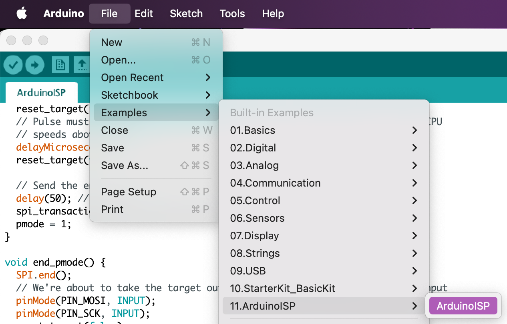
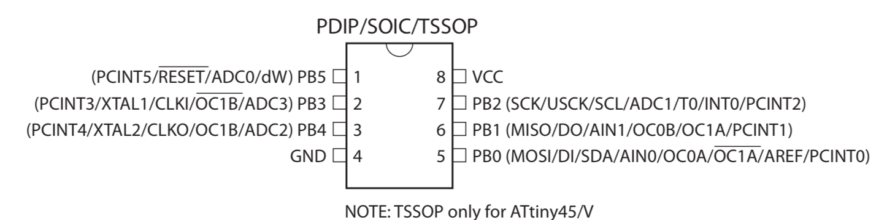
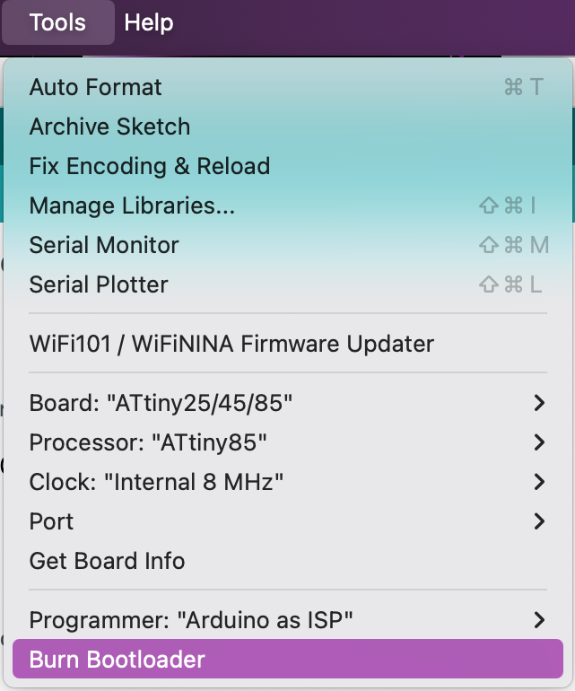

# ATtiny85 blink

## Description
This demonstrates how to build, upload and debug ATtiny85 program. This is done in Ubuntu VM.

## Prerequisite
### Ubuntu installation
```bash
sudo apt install gcc-avr binutils-avr avr-libc avrdude make
sudo apt install -y simulavr gdb-avr (for debugging)
```

### Arduino ISP
Use Arduino UNO as ISP to update fuses and upload code.

1. Upload the ArduinoISP code to UNO


2. Hardware connection and update fuses

    

    | Arduino | ATtiny85 | Function |
    |----------|-----------|-----------|
    | 10 | 1 | RESET |
    | 11 | 5 | MOSI |
    | 12 | 6 | MISO |
    | 13 | 7 | SCK |
    | 5V | 8 | VCC |
    | GND | 4 | GND |

    *Add a 10 µF capacitor between Arduino **RESET** and **GND**.

    

## Build and upload
The example (blink.c) is using PB0 to blink LED.

`make PORT=<YOUR PORT>`

## Debugging
For debugging, use -O0 to disable optimization, otherwise gdb will hang.
Use #define SIMULATOR so that it won't debug inside.

1. Run `make debug`
2. Open another terminal, run `avr-gdb blink.elf`
    ```
    (gdb) target remote localhost:1212
    (gdb) load
    (gdb) step
    ...
    (gdb) quit
    ```

## Keywords


